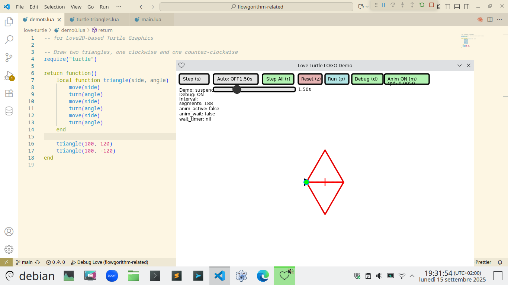

# Flowgorithm Related

## Screenshots ( for Love2D-based Turtle Graphics )

### Example : Two Triangles basic example

```lua
-- love-turtle/demo0.lua
local function triangle(side, angle)
    move(side)
    turn(angle)
    move(side)
    turn(angle)
    move(side)
    turn(angle)
end

triangle(100, 120)
triangle(100, -120)
```

Draw two triangles, one clockwise and one counter-clockwise.


